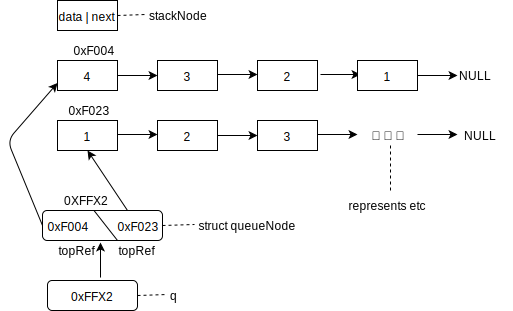
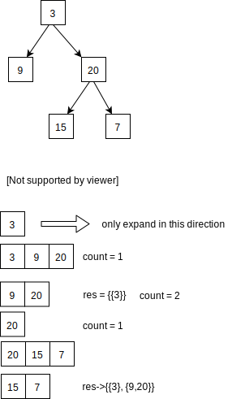

# Free memory allocated from heap
To free memory allocated from heap by 
```c
struct TreeNode *t = (struct TreeNode *)calloc(3, sizeof(struct TreeNode));
free(t);
```


# Demo of part code from [`sametree.c`](sametree.c)


# AVL tree


# [`levelOrderTraversal_1.c`](levelOrderTraversal_1.c)
When you think you know well enough about pointers, boom, here comes `BTLevelOrderTraversal_1.c` to improve you are wrong.

Review how to implement a heap by 2 stacks to help understand the more complex usage of pointers.



# [`levelOrderTraversal_2.cpp`](levelOrderTraversal_2.cpp)


# [`iterativeWayInorderTraversal.cpp`](iterativeWayInorderTraversal.cpp)
* playing with multiple pointers dynamically isn't easy.
* C language is easy to make mistake(not safe too), you should learn to avoid the mistake as early as possible. 
  * explicitly show the mistake if something went wrong, don't let the mistake pass silently.
  * debug the code efficiently to locate where the error is.

# Makefile
Compare to a [bash script](generateABST.sh), you just collect all the bash commands into a file, nothing more. it is feasible when the dependency relation is easy,

with [`Makefile`](Makefile)
* you can generate multiple executable once for all.
* ...

## Reference
* http://www.cs.colby.edu/maxwell/courses/tutorials/maketutor/
* https://makefiletutorial.com/

# Generic programming
A common requirement when writing code is the ability to  use the identical, or nearly identical code for different data types.

in `tree.h`, I define 3 functions.
```c
struct TreeNode * newNode(int val);
struct AVLTreeNode* newAVLTreeNode(int val);

void freeBinaryTree(struct TreeNode* root); 
void freeAVLTree(struct AVLTreeNode* root); 

int ** levelOrderBinaryTreeTranversal(struct TreeNode *root, int **numberOfElementsInEachRow, int *numberOfRows);
int ** levelOrderAVLTreeTranversal(struct AVLTreeNode *root, int **numberOfElementsInEachRow, int *numberOfRows);
```
I just write the same code for multiple times.

## reference
* https://attractivechaos.wordpress.com/2008/09/02/generic-programming-in-c/