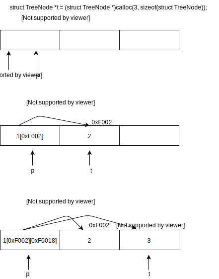
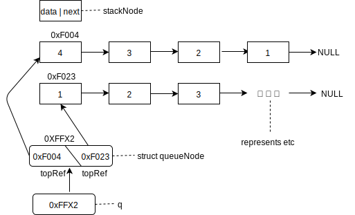
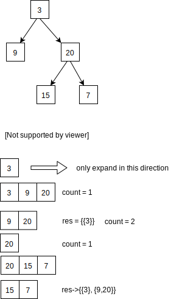

# Free memory allocated from heap
To free memory allocated from heap by 
```c
struct TreeNode *t = (struct TreeNode *)calloc(3, sizeof(struct TreeNode));
free(t);
```


# Demo of part code from `sametree.c`


# AVL tree


# `BTLevelOrderTraversal_1.c`
When you think you know well enough about pointers, boom, here comes `BTLevelOrderTraversal.c` to improve you are wrong.

Review how to implement a heap by 2 stacks to help understand the more complex usage of pointers.



# `BTLevelOrderTraversal_2.cpp`
