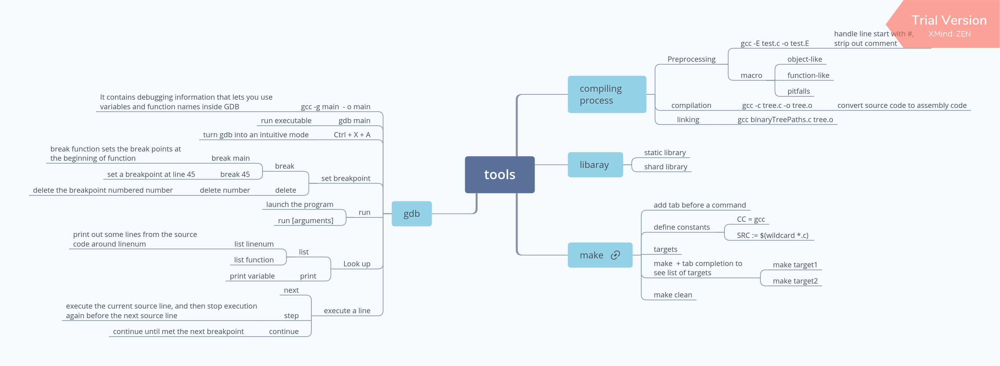

# Overview 
It's a project mainly about introducing `C`, meanwhile, a certain amount of `CPP` is involved . It aims to become a useful reference to look up the key usage of features in C and obeys the [modern standard](https://gcc.gnu.org/wiki/HomePage) as much as possible.

* `lcthw` is the handy practice on the book `Learn C the Hard way` by [Zed A Shaw](https://zedshaw.com).
* `library` is third party library. 
  * `GSL` is used to assist scientific computation supported by [GNU Scientific Library](http://www.gnu.org/software/gsl/).
  * `POSIX` make use of the hardware's improvements.


# Main features
* [ ] Documentation.

  ❌ `Doxygen` is not an idea tool to make documentation to me, I really can't agree with its taste. (I was wrong, I didn't know what I was talking about.)

  Basic procedure 
  - `doxygen -g` 
  - customize `Doxyfile`
    
    eg: Modify the items as below
    ```
    PROJECT_NAME           = "C Training"
    PROJECT_NUMBER         = "1.0"
    # Where to put the file generated by doxygen Doxyfile
    OUTPUT_DIRECTORY       = "docs"
    # Extract the comment from all source code in the specified directory
    EXTRACT_ALL            = YES
    QUIET                  = YES
    # Specify what to include in documentation.
    INPUT                  = LeetCode/Tree LeetCode/LinkedList
    RECURSIVE              = YES
    GENERATE_LATEX         = NO
    ```
  - `doxygen  Doxyfile`
   
  - publish it to github pages
    
    https://goseeky.wordpress.com/2017/07/22/documentation-101-doxygen-with-github-pages/

 
  :guitar: [slate an API generator](https://github.com/lord/slate)

* [x] New features on C
  - [x] Object Oriented programming
  - [ ] Generic programming
* [x] Informative
  * Basic
    - [x] Library
    - [x] Array
      - [x] Dynamic array
    - [x] Pointer
    - [x] Function
    - [x] Memory management
  * Advanced
    - [x] OOP
    - [x] multithreading
    - [ ] Error handling
  * Data structure
    - [x] Linked List
    - [x] Stack 
    - [x] Queue
    - [x] Heap
    - [x] Hash table
      - [x] Linear probing
      - [ ] Chaining
      - [ ] Re-Hashing
    - [x] tree
      - [x] Binary tree
      - [x] Binary search tree
      - [x] AVL Tree
      - [ ] Red black tree
        - [x] beta version
      - [ ] B Tree
      - [ ] B+ Tree

    - [ ] Graph
      - [ ] Breadth-First search
      - [ ] Depth-First search
      - [ ] shorted-path algorithm
  * Algorithm
    * [x] Sort
      - [x] Bubble sort
      - [x] Select sort
      - [x] Quick sort
      - [x] Merge sort
      - [x] Heap sort
      - [x] Bucket sort
      - [x] Counting sort
      - [x] Insertion sort
      - [x] Radix sort
    * [x] Search
      - [x] Binary search 
  * Third-party library
    - [x] Database
      - [x] PostgreSQL
      - [ ] redis
    - [x] GNU Scientific Library 
    - [x] Test framework
      - [ ] [catch.hpp](https://github.com/catchorg/Catch2)

* [ ] writing robust code
  - [ ] Debug 
  - [ ] Automated test

  

# Memory leak testing
* Applying Docker to solve the the problem of no proper `Valgrind` for a specific OS version.
* [Developing inside a Container!](https://code.visualstudio.com/docs/remote/containers)
  > The Visual Studio Code Remote - Containers extension lets you use a Docker container as a full-featured development environment. It allows you to open any folder inside (or mounted into) a container and take advantage of Visual Studio Code's full feature set.

# `gdb` usage
* https://sourceware.org/gdb/onlinedocs/gdb/
* https://betterexplained.com/articles/debugging-with-gdb/

# Configure a handy text editor
* `Vim`. 

  [A reference for beginner to set it up for C](https://stackoverflow.com/questions/14533877/ideal-c-setup-for-vim)
* `Atom`
* `VS code`

# Warnings and directions
The small program is tomorrow's building block in a larger project. So avoid writing any one program ugly, think it over and over to make it robust and exquisite.

There are some standards to test whether or not you are qualified to do the programming job. You shouldn't say things like -I have no idea of how to be a qualified programmer again.

## Standards to tell you whether or not you are qualified
It's not hard to be a good programmer compared with to be a good physicist.

There are many resources already available online. You need to go through several tests. You can clearly see different stages which you are in along the way toward realizing what you long for.

* What the basics you are supposed to know.
* There are many problems for you to take a try.          
  Tackling down the problems help you to understand how things work better.  
* [When you can ask for an interview](https://youtu.be/ko-KkSmp-Lk)?
* [Code Jam: Advanced level to participate](https://code.google.com/codejam/).
* [leetcode](https://leetcode.com/problemset/all/), take the challenge.
