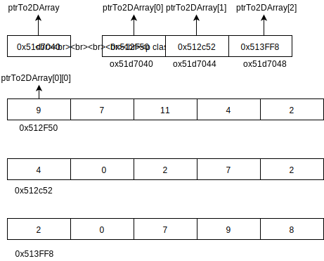

http://pages.tacc.utexas.edu/~eijkhout/istc/html/language.html

**Why do we need dynamic array? when to use it?**

<div class="alert alert-block alert-success">
The C programming language does not have dynamic array as a language feature


The C programming language does have sufficient number of powerful features that a C programmer can implement dynamic array (among other things) using these features !!!
</div>

http://www.mathcs.emory.edu/~cheung/Courses/255/Syllabus/2-C-adv-data/dyn-array.html


## Dynamic array declaration and initialization
`dynamicArray.c`

step to dynamic array declaration and initialization
* Define a reference variable (say p) of the desired data type
* Allocate memory cells for the array elements and make p point to the first array element




The address of C array is column-contigious, the address of Fortran array is row-contigious.

**Does `calloc` and `malloc` has the same function?**

The C library function void `*calloc(size_t nitems, size_t size)` allocates the requested memory and returns a pointer to it. The difference in `malloc` and `calloc` is that` malloc` does not set the memory to zero where as calloc sets allocated memory to zero.


The C library function void `*realloc(void *ptr, size_t size)` attempts to resize the memory block pointed to by ptr that
was previously allocated with a call to malloc or calloc.


```c
int* test = (int*) malloc(20 * sizeof(int));
printf("Size: %d\n", sizeof(test)); //8
```
The C language will only keep track of buffer sizes for statically allocated buffers (stack arrays) because the size of the array is available at compile time.


## Static array initialization
[Array initialization](https://stackoverflow.com/a/2589751/7583919)

```c
char ZEROARRAY[1024] = {0};
// Alternatively
memset(ZEROARRAY, 0, 1024);
```

The C library function `void *memset(void *str, int c, size_t n)` copies the character c (an unsigned char) to the first
n characters of the string pointed to, by the argument str.

## Generate a random list without duplicated elements
* `noDuplicatedRandomNumber.c`. very likely generating  repeated number
* `effcientNonDuplicateRandomNumberGenerator.c` generate a unique number at each time.

[How to return multiple values from a function in C](https://stackoverflow.com/questions/2620146/how-do-i-return-multiple-values-from-a-function-in-c)

